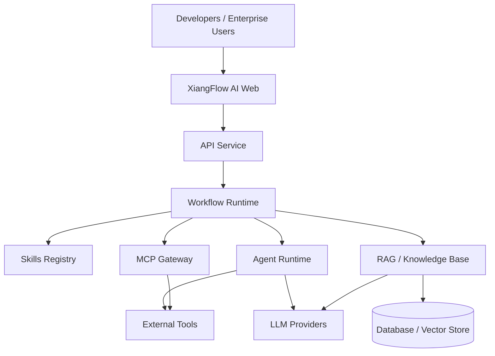

<!-- markdownlint-disable MD033 MD041 -->

<div align="center">

# XiangFlow AI · 翔域智流

基于 Skills、MCP、Agent 和可视化编排的开源 AI 工作流平台。

[简体中文](./README.md) · [English](./README_EN.md)

[](./LICENSE)
[](https://github.com/lien0219/xiangflow-ai/stargazers)
[](https://github.com/lien0219/xiangflow-ai/forks)
[](https://github.com/lien0219/xiangflow-ai/issues)
[](https://github.com/lien0219/xiangflow-ai/pulls)


</div>

> [!IMPORTANT]
> XiangFlow AI 是基于 [Langflow](https://github.com/langflow-ai/langflow) 独立维护的下游项目，不是 Langflow 官方发行版。项目保留上游版权声明并继续遵循仓库中的 MIT License。

## 目录

- [项目简介](#-项目简介)
- [为什么选择 XiangFlow AI](#为什么选择-xiangflow-ai)
- [核心能力](#-核心能力)
- [技术架构](#️-技术架构)
- [技术栈](#技术栈)
- [快速开始](#-快速开始)
- [项目目录](#项目目录)
- [分支与二开流程](#-分支与二开流程)
- [开发文档](#开发文档)
- [Roadmap](#️-roadmap)
- [参与贡献](#-参与贡献)
- [上游项目与致谢](#上游项目与致谢)
- [License](#-license)
- [联系与社区](#联系与社区)

## ⚡ 项目简介

翔域智流（XiangFlow AI）是基于 Langflow 二次开发的开源 AI 工作流平台。项目面向开发者与企业团队，围绕可视化编排、Agent、Skills、MCP、RAG、扩展组件和 API 服务，建设可持续演进的 AI 应用开发与运行基础设施。

项目目标包括：

- 可视化 AI 工作流编排
- Agent 构建与运行
- Skills 能力封装
- MCP 工具接入与发布
- RAG 与企业知识库
- 自定义工作流组件
- 模型供应商扩展
- API 化工作流服务
- 面向开发者和企业的扩展能力

### 当前继承能力

以下能力来自当前 Langflow 上游代码基础：

- 可视化工作流画布与节点编排
- Agent 和 LLM 工作流
- REST API 服务与流程 API 化
- MCP Server、MCP Client 及工作流工具化相关能力
- Python 自定义组件
- 多模型供应商和多种向量数据库集成
- 工作流导入、导出与 JSON 表达
- Python、FastAPI、React 和 TypeScript 技术栈

### XiangFlow AI 二开方向

以下内容是 XiangFlow AI 的重点规划或建设方向，不代表当前版本已全部实现：

- Skills Registry（规划中）
- MCP 管理中心（规划中）
- 工作流版本管理（规划中）
- 项目级规则管理（规划中）
- 多租户与完整 RBAC 能力（规划中；当前仓库仅包含可插拔授权基础）
- 审计日志与管理能力（建设中；当前仓库已包含部分授权审计基础）
- 用量统计（规划中）
- 工作流模板市场（规划中）
- 企业知识库（规划中）
- 多编辑器接入（规划中）
- Cursor、Codex、Claude Code 等开发工具接入（规划中）

## 为什么选择 XiangFlow AI

| 能力 | 说明 |
| --- | --- |
| 可视化编排 | 使用节点画布构建、调试和运行 AI 工作流 |
| Skills | 将规则、流程和领域能力封装为可复用 Skill（重点 Roadmap） |
| MCP | 连接外部工具、编辑器和 Agent 客户端 |
| Agent | 支持工具调用、知识检索和任务执行 |
| 可扩展组件 | 使用 Python 扩展工作流节点和集成 |
| API 化 | 将工作流作为 API 或工具对外提供 |
| 开源二开 | 保留清晰的上游同步、隔离开发和发布机制 |

## ✨ 核心能力

### 可视化工作流

- 节点编排与数据传递
- 条件分支和流程控制
- 模型与工具调用
- 交互式调试和运行
- 工作流导入与导出

### 🤖 Agent 与大模型

- Agent 工作流与任务执行
- 多模型供应商接入
- Prompt 配置与上下文处理
- 工具调用和知识检索
- 结构化输出

### 🧩 Skills

Skills 是 XiangFlow AI 的重点扩展方向，目标是将项目规则、标准流程和领域能力封装为可发现、可复用、可版本化的能力单元。Skills Registry、导入导出和版本管理目前属于 Roadmap，不应视为已经交付的完整系统。

### 🔗 MCP

当前上游基础包含 MCP Server、MCP Client 以及将工作流作为 MCP 工具使用的相关能力。XiangFlow AI 将继续面向 MCP 服务管理、客户端连接、工具发布和权限治理进行扩展；统一的 MCP 管理中心仍在规划中。

### RAG 与知识库

项目可通过现有组件组合文档加载与解析、Embedding、向量存储、检索和模型生成流程，并集成 Chroma、Qdrant、Weaviate、Pinecone、Milvus、MongoDB Atlas、Astra DB 等向量存储。企业级知识库、引用治理和完整管理体验仍属于建设方向。

### 扩展开发

- 使用 Python 创建自定义组件
- 通过 REST API 调用和发布工作流
- 扩展模型、向量数据库与外部工具集成
- 通过 LFX 运行时和服务插件机制扩展后端能力

## 🏗️ 技术架构



> 图中展示目标架构。Skills Registry、统一 MCP Gateway 和企业知识库等 XiangFlow AI 扩展模块仍处于规划或建设阶段；当前运行基础主要继承自 Langflow 与 LFX。

## 技术栈

| 层级 | 当前技术 |
| --- | --- |
| 前端 | React 19、TypeScript、Vite、Tailwind CSS、Zustand、XYFlow |
| 后端 | Python 3.10–3.14、FastAPI、SQLModel / SQLAlchemy、Alembic |
| 工作流 | Langflow、LFX |
| Agent | LangChain 生态、LangGraph Checkpoint |
| 协议 | REST API、MCP |
| 数据库 | SQLite（内置异步支持）、PostgreSQL（可选依赖）；另有 MongoDB、Redis、Elasticsearch 等组件集成 |
| 向量数据库 | Chroma、Qdrant、Weaviate、Pinecone、Milvus、MongoDB Atlas、Astra DB、FAISS、Upstash Vector 等 |
| 部署 | Docker / Podman、Docker Compose、Dev Container |

## 🚀 快速开始

### 环境要求

| 工具 | 要求 |
| --- | --- |
| Python | `>=3.10,<3.15` |
| Node.js | `>=20.19.0`，推荐 v22.12 LTS |
| npm | v10.9+ |
| uv | `>=0.4` |
| make | 用于协调安装、构建和运行 |
| Docker / Podman | 可选，用于容器化开发或部署 |

> Windows 用户建议使用 WSL 或仓库内置的 Dev Container。

### 克隆仓库

SSH：

```bash
git clone git@github.com:lien0219/xiangflow-ai.git
cd xiangflow-ai
```

HTTPS：

```bash
git clone https://github.com/lien0219/xiangflow-ai.git
cd xiangflow-ai
```

### 一键构建并启动

仓库根目录的 `make run_cli` 会安装依赖、构建前端并启动应用：

```bash
make run_cli
```

默认访问地址：<http://localhost:7860>。

如遇前端缓存或构建问题，可执行一次干净构建：

```bash
make run_clic
```

### 开发模式

先完成完整环境初始化：

```bash
make init
```

然后分别在两个终端启动后端和前端：

```bash
make backend
```

```bash
make frontend
```

后端默认运行在 `http://localhost:7860`，前端开发服务器默认运行在 `http://localhost:3000`。

有关 Dev Container、组件动态加载、测试和故障排查，请查看[完整开发指南](./DEVELOPMENT.md)。

## 项目目录

```text
xiangflow-ai/
├── .github/            # GitHub 工作流与仓库配置
├── deploy/             # 部署与可观测性配置
├── docker/             # 容器构建与开发配置
├── docker_example/     # Docker Compose 示例
├── docs/               # Docusaurus 文档
├── scripts/            # 构建、测试和维护脚本
├── src/
│   ├── backend/        # FastAPI 后端与 Langflow 核心
│   ├── frontend/       # React / TypeScript 前端
│   ├── lfx/            # 轻量工作流执行器
│   └── sdk/            # SDK 源码
├── README.md           # 简体中文说明
├── README_EN.md        # English documentation
├── CUSTOMIZATION.md    # 二开与上游同步规范
├── DEVELOPMENT.md      # 开发环境指南
└── CONTRIBUTING.md     # 贡献指南
```

## 🌿 分支与二开流程

```text
upstream/main
      ↓
  official
      ↓
  upgrade/*
      ↓
   develop
      ↓
  release/*
      ↓
     main
```

- `official`：只负责同步 Langflow 上游，不承载 XiangFlow AI 功能开发。
- `develop`：日常开发、修复和上游升级结果的集成分支。
- `main`：经过验证的稳定发布分支。
- `feature/*`：从 `develop` 创建，通过 Pull Request 合回 `develop`。
- `fix/*`：从 `develop` 创建，用于普通缺陷修复。
- `upgrade/*`：从 `develop` 创建，合入并验证 `official` 或指定上游版本。
- `release/*`：从 `develop` 创建，完成发布准备后合入 `main`。

完整流程、冲突处理和上游同步规则见 [CUSTOMIZATION.md](./CUSTOMIZATION.md)。

## 开发文档

| 文档 | 说明 |
| --- | --- |
| [DEVELOPMENT.md](./DEVELOPMENT.md) | 本地开发、Dev Container 和环境配置 |
| [CUSTOMIZATION.md](./CUSTOMIZATION.md) | XiangFlow AI 二开规范与上游同步 |
| [CONTRIBUTING.md](./CONTRIBUTING.md) | 贡献指南 |
| [SECURITY.md](./SECURITY.md) | 上游安全策略与漏洞报告方式 |
| [CODE_OF_CONDUCT.md](./CODE_OF_CONDUCT.md) | 社区行为准则 |
| [LICENSE](./LICENSE) | MIT License 与版权声明 |

## 🗺️ Roadmap

Roadmap 用于表达方向，不构成版本交付承诺。以下项目均为未完成或持续建设状态：

### Phase 1：品牌和二开基础

- [ ] XiangFlow AI 品牌替换
- [ ] 中英文文档体系
- [ ] 二开分支规范落地
- [ ] 上游同步流程完善
- [ ] 自定义组件基础

### Phase 2：Skills 与 MCP

- [ ] Skills Registry
- [ ] Skill 导入与导出
- [ ] Skill 版本管理
- [ ] MCP Server 管理
- [ ] MCP Client 管理
- [ ] 工作流发布为 MCP Tool

### Phase 3：企业能力

- [ ] 多租户
- [ ] 完整 RBAC
- [ ] 审计日志管理
- [ ] 用量统计
- [ ] 企业知识库
- [ ] 工作流版本管理

### Phase 4：生态扩展

- [ ] 模板市场
- [ ] 组件市场
- [ ] Skills 市场
- [ ] XiangFlow AI SDK
- [ ] Cursor、Codex、Claude Code 等客户端接入

## 🤝 参与贡献

从最新的 `develop` 创建功能分支：

```bash
git switch develop
git pull origin develop
git switch -c feature/your-feature
```

完成开发、检查和测试后，推送分支并创建 Pull Request：

```text
feature/your-feature -> develop
```

提交信息应遵循 Conventional Commits。开始前请阅读[贡献指南](./CONTRIBUTING.md)和[二开规范](./CUSTOMIZATION.md)。

## 上游项目与致谢

XiangFlow AI 基于 Langflow 开源项目开发。感谢 Langflow 团队及所有上游贡献者提供的工作流引擎、可视化编辑器、组件生态和持续维护。

- [Langflow GitHub](https://github.com/langflow-ai/langflow)
- [Langflow 官方文档](https://docs.langflow.org/)
- [XiangFlow AI `official` 分支](https://github.com/lien0219/xiangflow-ai/tree/official)

XiangFlow AI 是独立维护的下游项目，不代表 Langflow 官方发行版。仓库中的 Langflow 原始版权和许可证声明继续有效。

## 📄 License

本项目继续遵循仓库 [LICENSE](./LICENSE) 文件中的 MIT License 要求。使用、修改或分发本项目时，请：

- 保留原始版权声明；
- 保留 MIT License；
- 遵守第三方依赖各自的许可证；
- 使 XiangFlow AI 新增代码遵循项目约定及适用的开源许可要求。

本 README 不改变或替代 `LICENSE` 文件中的任何条款。

## 联系与社区

当前社区协作以 GitHub 为主：

- [GitHub Issues](https://github.com/lien0219/xiangflow-ai/issues) — 报告缺陷或提出建议
- [Pull Requests](https://github.com/lien0219/xiangflow-ai/pulls) — 提交代码和文档改进
- [XiangFlow AI 仓库](https://github.com/lien0219/xiangflow-ai)
