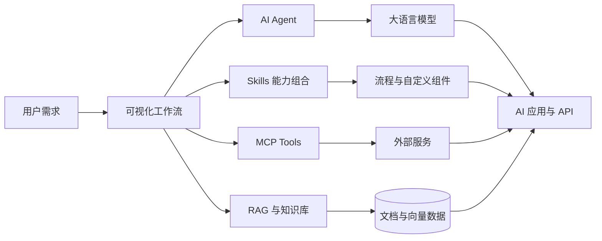
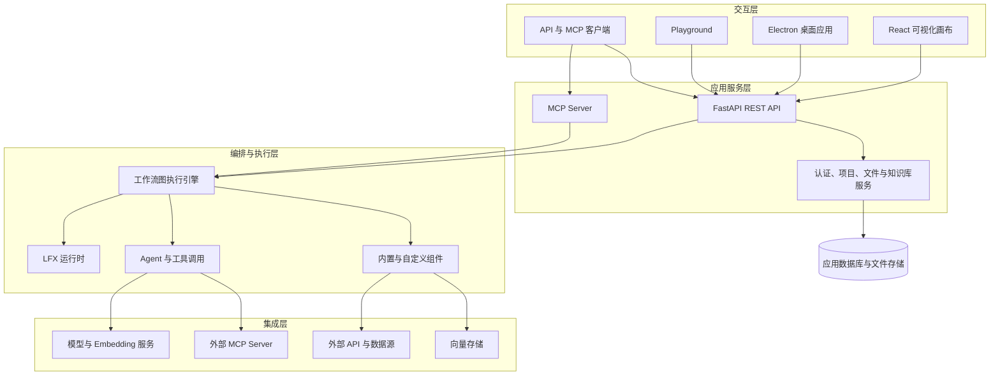

<!-- markdownlint-disable MD001 MD033 MD041 -->

<div align="center">

# OpenXFlow

### 让 AI 工作流构建更简单、更开放、更智能

面向开发者的开源 AI 工作流平台。

[简体中文](./README.md) · [English](./README_EN.md)

[](./LICENSE)
[](https://github.com/lien0219/openxflow/stargazers)
[](https://github.com/lien0219/openxflow/forks)
[](https://github.com/lien0219/openxflow/issues)
[](https://github.com/lien0219/openxflow/pulls)


[快速开始](#-快速开始) · [桌面端](#桌面端运行) · [核心能力](#-核心能力) · [开发文档](#-文档) · [参与贡献](#-参与贡献) · [GitHub Issues](https://github.com/lien0219/openxflow/issues)

</div>

## 产品介绍

OpenXFlow 是一个面向开发者的开源 AI 工作流平台。通过可视化画布，开发者可以连接大语言模型、Agent、知识库、数据源、API 和外部工具，快速构建、调试、运行和集成 AI 应用。

平台融合可视化工作流、Agent 编排、MCP 工具协议、Skills 能力组织和 RAG 知识检索，让复杂 AI 应用能够以模块化、可复用、可扩展的方式构建。

OpenXFlow 同时支持浏览器运行与 Windows、macOS 桌面端。

> 让每一个 AI 能力，都能够被连接、编排和复用。

## ✨ 产品亮点

| 能力 | 说明 |
| --- | --- |
| 可视化工作流 | 通过节点画布连接模型、Prompt、工具、知识库与业务逻辑 |
| AI Agent | 构建能够理解任务、选择工具并完成多步骤工作的智能体 |
| Skills 扩展 | 通过可复用流程、提示词、规则、工具与组件沉淀领域能力 |
| MCP 生态 | 作为 MCP Client 连接外部工具，并将项目中的工作流作为 MCP 工具提供 |
| RAG 与知识库 | 组合文档处理、Embedding、向量检索与上下文增强能力 |
| 多模型支持 | 连接主流云端模型、本地模型与兼容 API 的模型服务 |
| 自定义组件 | 使用 Python 扩展节点、工具、数据处理和业务集成 |
| API 服务 | 通过 REST API、Webhook 与 MCP 将工作流接入现有系统 |
| 桌面应用 | 基于 Electron 支持 Windows x64、macOS Apple Silicon 与 Intel |
| 开源部署 | 支持本地运行、桌面运行、容器构建、私有化部署与定制集成 |

## 🧩 核心能力

### 可视化 AI 工作流

- 使用节点画布拖拽、连接和配置工作流
- 组合模型、Prompt、数据、工具与流程控制组件
- 在节点间传递文本、消息、数据和结构化结果
- 通过 Playground 交互测试并查看流程执行结果
- 以 JSON 导入、导出和复用工作流
- 通过 REST API、Webhook 或 MCP 运行工作流

### AI Agent

- 在可视化流程中构建 Agent，配置模型、指令和上下文
- 将内置组件、其他 Agent 与 MCP Server 作为可调用工具
- 根据任务选择工具并执行多步骤处理
- 接入会话记忆、知识检索和结构化输出组件
- 在 Playground 或 API 调用中调试 Agent 行为

### Skills

Skills 是 OpenXFlow 组织可复用 AI 能力的方式。领域知识、任务步骤、提示词、规则、工具与资源可以通过工作流和自定义组件组合封装，形成清晰、可组合的能力入口，并在不同 AI 应用中复用。

### MCP

- 通过 MCP Tools 组件连接外部 MCP Server
- 支持 STDIO、Streamable HTTP 和兼容 SSE 的连接方式
- 在设置页或画布侧边栏配置和使用 MCP Server
- 将项目中的工作流作为 MCP 工具提供给外部客户端
- 支持 Cursor、Windsurf、Claude Desktop 等 MCP 客户端连接

### RAG 与知识库

- 上传和处理文档，进行文本提取、切分与元数据管理
- 使用 Embedding 模型生成向量表示
- 通过知识库和向量存储完成语义检索
- 将检索结果注入模型上下文，构建知识问答流程
- 通过组件连接文件、数据库、网页和第三方数据源

### 模型与组件生态

- 集成多种大语言模型、Embedding 模型和本地模型服务
- 提供向量数据库、数据处理、输入输出和工具组件
- 使用 Python 编写自定义组件并加入可视化画布
- 通过 API Request、Webhook 和第三方集成连接业务系统
- 基于 LFX 执行引擎扩展和运行工作流

## 🔄 工作方式



从需求出发，在画布中组合 Agent、可复用能力、MCP 工具与知识检索；工作流可以在 Web 或桌面界面中运行，也可以通过 API、Webhook 或 MCP 集成到业务系统。

## 🎯 应用场景

| 场景 | 说明 |
| --- | --- |
| 企业知识库 | 连接企业文档、数据源与模型，构建带知识检索能力的智能问答系统 |
| AI 客服 | 组合 Agent、知识库、工具调用和业务 API，构建可控的客服工作流 |
| 数据分析 Agent | 让 Agent 连接数据库、API 和分析工具，完成查询、分析与结果生成 |
| 内容生成 | 编排模型、Prompt、数据处理与输出组件，构建可复用的内容生产流程 |
| 开发者工具 | 通过 MCP 和可复用能力连接代码工具、编辑器与开发流程 |
| 业务流程自动化 | 连接企业系统、外部 API 和 AI 模型，自动处理多步骤业务任务 |

## 🏗️ 技术架构



- **交互层**：提供 Web 可视化画布、Electron 桌面应用、Playground，以及 API 和 MCP 客户端入口。
- **应用服务层**：FastAPI 承载工作流、项目、文件、知识库、认证与 MCP 接口。
- **编排与执行层**：工作流图和 LFX 运行时负责节点调度、数据传递、Agent 与组件执行。
- **集成层**：连接模型服务、MCP Server、业务 API、数据源与向量存储。

## 技术栈

| 领域 | 技术 |
| --- | --- |
| 前端 | React 19、TypeScript、Vite、Tailwind CSS、Zustand、XYFlow |
| 后端 | Python 3.10–3.14、FastAPI、SQLModel / SQLAlchemy、Alembic |
| 桌面端 | Electron、electron-builder、Windows NSIS、macOS DMG |
| 工作流 | Langflow 图执行引擎、LFX |
| Agent | LangChain 生态、工具调用、结构化输出 |
| 协议 | REST API、Webhook、MCP |
| 数据存储 | SQLite、可选 PostgreSQL、文件存储 |
| 向量检索 | Chroma、Qdrant、Weaviate、Pinecone、Milvus、FAISS 等组件 |
| 部署 | Web 本地运行、Windows/macOS 桌面端、Docker / Podman、Docker Compose、Dev Container |

## 🚀 快速开始

### 环境要求

- Python `>=3.10,<3.15`
- Node.js `>=20.19.0`（推荐 v22.12 LTS）与 npm v10.9+
- `uv >=0.4`
- Web 源码开发需要 GNU Make

Windows Web 开发建议使用 WSL 或仓库内置的 Dev Container；Windows 桌面端直接在 Windows 环境中运行。

### 克隆仓库

使用 SSH：

```bash
git clone git@github.com:lien0219/openxflow.git
cd openxflow
```

或使用 HTTPS：

```bash
git clone https://github.com/lien0219/openxflow.git
cd openxflow
```

### Web 本地运行

安装依赖、构建前端并启动应用：

```bash
make run_cli
```

访问 <http://localhost:7860>。如需清理前端构建缓存后重新启动，可运行：

```bash
make run_clic
```

### 桌面端运行

支持 Windows x64、macOS Apple Silicon arm64 和 macOS Intel x64。

首次安装桌面工程依赖并一键初始化启动：

```bash
npm --prefix desktop install
npm --prefix desktop run dev:setup
```

初始化完成后，日常启动：

```bash
npm --prefix desktop run dev
```

安装包构建、平台环境和常见问题请查看[桌面端指南](./DESKTOP.md)。

### 开发模式

```bash
make init
```

分别在两个终端启动后端和前端：

```bash
make backend
```

```bash
make frontend
```

后端默认监听 `http://localhost:7860`，前端开发服务器默认监听 `http://localhost:3000`。更多环境配置、测试和组件开发说明请查看[完整开发指南](./DEVELOPMENT.md)。

### 容器构建与运行

仓库提供容器构建目标，可使用 Docker 构建当前源码：

```bash
make docker_build DOCKER=docker
docker run --rm -p 7860:7860 langflow:1.10.2
```

## 项目结构

```text
openxflow/
├── .github/                 # GitHub 工作流与仓库配置
├── deploy/                  # 部署与可观测性配置
├── desktop/                 # Electron 桌面端、原生运行时与打包脚本
├── docker/                  # 容器构建与开发配置
├── docker_example/          # Docker Compose 示例
├── docs/                    # Docusaurus 文档
├── scripts/                 # 构建、测试和维护脚本
├── src/
│   ├── backend/             # FastAPI API 与应用服务
│   ├── frontend/            # React / TypeScript Web 应用
│   ├── lfx/                 # 轻量工作流执行器
│   ├── langflow-stepflow/   # 工作流步骤执行支持
│   ├── sdk/                 # Python SDK
│   └── bundles/             # 可选组件扩展包
├── DESKTOP.md               # Windows 与 macOS 桌面端指南
├── README.md                # 简体中文产品介绍
├── README_EN.md             # English product overview
├── DEVELOPMENT.md           # 开发环境指南
└── CONTRIBUTING.md          # 参与贡献指南
```

## 📚 文档

| 文档 | 说明 |
| --- | --- |
| [DESKTOP.md](./DESKTOP.md) | Windows/macOS 桌面端安装、启动、测试与打包 |
| [DEVELOPMENT.md](./DEVELOPMENT.md) | 本地开发、Dev Container 与环境配置 |
| [CUSTOMIZATION.md](./CUSTOMIZATION.md) | 项目维护与定制开发指南 |
| [CONTRIBUTING.md](./CONTRIBUTING.md) | 参与贡献指南 |
| [SECURITY.md](./SECURITY.md) | 安全策略与漏洞报告方式 |
| [CODE_OF_CONDUCT.md](./CODE_OF_CONDUCT.md) | 社区行为准则 |
| [LICENSE](./LICENSE) | MIT License 与版权声明 |

## 🤝 参与贡献

欢迎社区开发者参与 OpenXFlow。你可以提交 Bug、提出功能建议、改进文档、开发组件、修复问题或提交 Pull Request。

- [提交 Issue](https://github.com/lien0219/openxflow/issues)
- [查看 Pull Requests](https://github.com/lien0219/openxflow/pulls)
- [阅读贡献指南](./CONTRIBUTING.md)

## 🙏 致谢

OpenXFlow 基于优秀的开源项目 [Langflow](https://github.com/langflow-ai/langflow) 构建。

特别感谢 Langflow 团队及所有社区贡献者，为可视化 AI 工作流和 Agent 开发生态作出的贡献。

同时感谢 LangChain、FastAPI、React、Electron 及相关开源项目和贡献者。

## 📄 License

本项目基于 [MIT License](./LICENSE) 开源。
