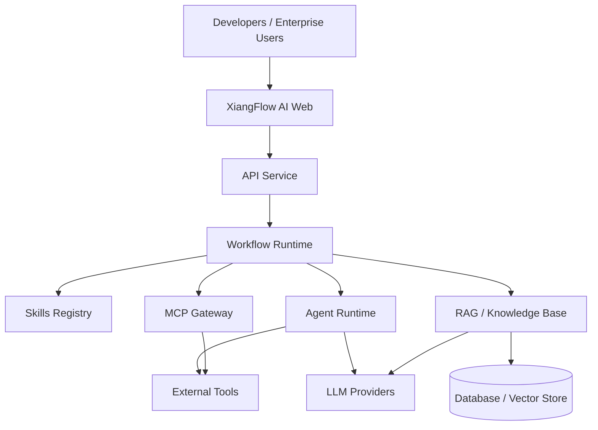

<!-- markdownlint-disable MD033 MD041 -->

<div align="center">

# XiangFlow AI

An open-source visual AI workflow platform powered by Skills, MCP, agents, and extensible components.

[简体中文](./README.md) · [English](./README_EN.md)

[](./LICENSE)
[](https://github.com/lien0219/xiangflow-ai/stargazers)
[](https://github.com/lien0219/xiangflow-ai/forks)
[](https://github.com/lien0219/xiangflow-ai/issues)
[](https://github.com/lien0219/xiangflow-ai/pulls)


</div>

> [!IMPORTANT]
> XiangFlow AI is an independently maintained downstream project based on [Langflow](https://github.com/langflow-ai/langflow). It is not an official Langflow distribution. The project preserves upstream copyright notices and remains subject to the repository's MIT License.

## Table of Contents

- [Project Overview](#-project-overview)
- [Why XiangFlow AI](#why-xiangflow-ai)
- [Core Capabilities](#-core-capabilities)
- [Architecture](#️-architecture)
- [Technology Stack](#technology-stack)
- [Quick Start](#-quick-start)
- [Project Structure](#project-structure)
- [Branching and Custom Development](#-branching-and-custom-development)
- [Documentation](#documentation)
- [Roadmap](#️-roadmap)
- [Contributing](#-contributing)
- [Upstream and Acknowledgements](#upstream-and-acknowledgements)
- [License](#-license)
- [Community](#community)

## ⚡ Project Overview

XiangFlow AI is an open-source AI workflow platform developed as a downstream project based on Langflow. It is designed for developers and enterprise teams building visual workflows, agents, Skills, MCP integrations, RAG pipelines, extensible components, and API-based AI services.

The project aims to provide:

- Visual AI workflow orchestration
- Agent development and execution
- Reusable capability packaging through Skills
- MCP tool integration and publishing
- RAG and enterprise knowledge bases
- Custom workflow components
- Extensible model-provider integrations
- Workflows exposed as API services
- An extensible foundation for developers and organizations

### Capabilities inherited today

The current codebase inherits these capabilities from Langflow:

- A visual canvas for node-based workflow composition
- Agent and LLM workflows
- REST APIs and workflow API serving
- MCP Server, MCP Client, and workflow-as-tool capabilities
- Custom components written in Python
- Integrations with multiple model providers and vector databases
- Workflow import, export, and JSON representation
- A Python, FastAPI, React, and TypeScript technology stack

### XiangFlow AI development direction

The following items are planned or under development. They should not be interpreted as fully delivered features:

- Skills Registry (planned)
- Centralized MCP management (planned)
- Workflow version management (planned)
- Project-level rule management (planned)
- Multi-tenancy and complete RBAC (planned; the repository currently provides a pluggable authorization foundation)
- Audit-log management (in development; part of the authorization audit foundation already exists)
- Usage analytics (planned)
- Workflow template marketplace (planned)
- Enterprise knowledge base (planned)
- Multi-editor integration (planned)
- Integration with developer tools such as Cursor, Codex, and Claude Code (planned)

## Why XiangFlow AI

| Capability | Description |
| --- | --- |
| Visual orchestration | Build, debug, and run AI workflows on a node-based canvas |
| Skills | Package rules, processes, and domain expertise as reusable Skills (a key Roadmap area) |
| MCP | Connect external tools, editors, and agent clients |
| Agents | Combine tool use, knowledge retrieval, and task execution |
| Extensible components | Add workflow nodes and integrations with Python |
| API delivery | Expose workflows as APIs or tools |
| Open downstream development | Maintain a clear process for upstream sync, isolated customization, and releases |

## ✨ Core Capabilities

### Visual workflows

- Node orchestration and data flow
- Conditional branches and flow control
- Model and tool calls
- Interactive debugging and execution
- Workflow import and export

### 🤖 Agents and language models

- Agent workflows and task execution
- Multiple model-provider integrations
- Prompt configuration and context handling
- Tool calling and knowledge retrieval
- Structured output

### 🧩 Skills

Skills are a major XiangFlow AI development direction. The goal is to package project rules, standard operating procedures, and domain expertise into discoverable, reusable, and versioned capability units. The Skills Registry, import/export, and version-management experience remain Roadmap items rather than a completed management system.

### 🔗 MCP

The inherited platform already contains MCP Server, MCP Client, and workflow-as-MCP-tool capabilities. XiangFlow AI will build on this foundation with service management, client connectivity, tool publishing, and governance. A unified MCP management center is still planned.

### RAG and knowledge bases

Existing components can be composed for document loading and parsing, embeddings, vector storage, retrieval, and model generation. Available integrations include Chroma, Qdrant, Weaviate, Pinecone, Milvus, MongoDB Atlas, Astra DB, and other vector stores. Enterprise knowledge-base management, citation governance, and a complete administration experience remain development directions.

### Extension development

- Build custom components in Python
- Invoke and publish workflows through REST APIs
- Extend model, vector-database, and external-tool integrations
- Extend backend behavior through the LFX runtime and service plugin interfaces

## 🏗️ Architecture



> This diagram shows the target architecture. XiangFlow AI extensions such as the Skills Registry, unified MCP Gateway, and enterprise knowledge base are still planned or under development. The current runtime foundation is primarily inherited from Langflow and LFX.

## Technology Stack

| Layer | Current technology |
| --- | --- |
| Frontend | React 19, TypeScript, Vite, Tailwind CSS, Zustand, and XYFlow |
| Backend | Python 3.10–3.14, FastAPI, SQLModel / SQLAlchemy, and Alembic |
| Workflow | Langflow and LFX |
| Agents | The LangChain ecosystem and LangGraph Checkpoint |
| Protocols | REST API and MCP |
| Databases | SQLite with built-in async support and PostgreSQL as an optional dependency; component integrations also cover MongoDB, Redis, Elasticsearch, and others |
| Vector databases | Chroma, Qdrant, Weaviate, Pinecone, Milvus, MongoDB Atlas, Astra DB, FAISS, Upstash Vector, and others |
| Deployment | Docker / Podman, Docker Compose, and Dev Containers |

## 🚀 Quick Start

### Prerequisites

| Tool | Requirement |
| --- | --- |
| Python | `>=3.10,<3.15` |
| Node.js | `>=20.19.0`; v22.12 LTS is recommended |
| npm | v10.9+ |
| uv | `>=0.4` |
| make | Coordinates installation, builds, and local execution |
| Docker / Podman | Optional, for containerized development or deployment |

> Windows users should use WSL or the Dev Container included in this repository.

### Clone XiangFlow AI

SSH:

```bash
git clone git@github.com:lien0219/xiangflow-ai.git
cd xiangflow-ai
```

HTTPS:

```bash
git clone https://github.com/lien0219/xiangflow-ai.git
cd xiangflow-ai
```

### Build and run

From the repository root, `make run_cli` installs dependencies, builds the frontend, and starts the application:

```bash
make run_cli
```

The default URL is <http://localhost:7860>.

If you encounter stale frontend assets or build-cache problems, perform a clean build:

```bash
make run_clic
```

### Development mode

Initialize the complete development environment:

```bash
make init
```

Then start the backend and frontend in separate terminals:

```bash
make backend
```

```bash
make frontend
```

The backend runs at `http://localhost:7860` by default, while the frontend development server runs at `http://localhost:3000`.

See the [complete development guide](./DEVELOPMENT.md) for Dev Container setup, dynamic component loading, tests, and troubleshooting.

## Project Structure

```text
xiangflow-ai/
├── .github/            # GitHub workflows and repository configuration
├── deploy/             # Deployment and observability configuration
├── docker/             # Container builds and development configuration
├── docker_example/     # Docker Compose example
├── docs/               # Docusaurus documentation
├── scripts/            # Build, test, and maintenance scripts
├── src/
│   ├── backend/        # FastAPI backend and Langflow core
│   ├── frontend/       # React / TypeScript frontend
│   ├── lfx/            # Lightweight workflow executor
│   └── sdk/            # SDK source
├── README.md           # Simplified Chinese documentation
├── README_EN.md        # English documentation
├── CUSTOMIZATION.md    # Downstream development and upstream sync rules
├── DEVELOPMENT.md      # Development environment guide
└── CONTRIBUTING.md     # Contribution guide
```

## 🌿 Branching and Custom Development

```text
upstream/main
      ↓
  official
      ↓
  upgrade/*
      ↓
   develop
      ↓
  release/*
      ↓
     main
```

- `official`: mirrors Langflow upstream and must not contain XiangFlow AI feature development.
- `develop`: integration branch for day-to-day development, fixes, and validated upstream upgrades.
- `main`: stable release branch.
- `feature/*`: branches from `develop` and returns through a Pull Request to `develop`.
- `fix/*`: branches from `develop` for regular bug fixes.
- `upgrade/*`: branches from `develop` to merge and validate `official` or a selected upstream release.
- `release/*`: branches from `develop` for release preparation and merges into `main`.

See [CUSTOMIZATION.md](./CUSTOMIZATION.md) for the complete workflow, conflict-resolution rules, and upstream synchronization procedures.

## Documentation

| Document | Purpose |
| --- | --- |
| [DEVELOPMENT.md](./DEVELOPMENT.md) | Local development, Dev Container, and environment setup |
| [CUSTOMIZATION.md](./CUSTOMIZATION.md) | XiangFlow AI downstream conventions and upstream synchronization |
| [CONTRIBUTING.md](./CONTRIBUTING.md) | Contribution guidelines |
| [SECURITY.md](./SECURITY.md) | Upstream security policy and vulnerability reporting |
| [CODE_OF_CONDUCT.md](./CODE_OF_CONDUCT.md) | Community code of conduct |
| [LICENSE](./LICENSE) | MIT License and copyright notice |

## 🗺️ Roadmap

The Roadmap communicates direction and is not a delivery commitment. Every item below is incomplete or under continuous development:

### Phase 1: Branding and downstream foundations

- [ ] XiangFlow AI brand migration
- [ ] Bilingual documentation
- [ ] Downstream branch conventions
- [ ] Upstream synchronization workflow
- [ ] Custom-component foundation

### Phase 2: Skills and MCP

- [ ] Skills Registry
- [ ] Skill import and export
- [ ] Skill version management
- [ ] MCP Server management
- [ ] MCP Client management
- [ ] Publish workflows as MCP tools

### Phase 3: Enterprise capabilities

- [ ] Multi-tenancy
- [ ] Complete RBAC
- [ ] Audit-log management
- [ ] Usage analytics
- [ ] Enterprise knowledge base
- [ ] Workflow version management

### Phase 4: Ecosystem expansion

- [ ] Template marketplace
- [ ] Component marketplace
- [ ] Skills marketplace
- [ ] XiangFlow AI SDK
- [ ] Client integration for Cursor, Codex, Claude Code, and similar tools

## 🤝 Contributing

Create a feature branch from the latest `develop`:

```bash
git switch develop
git pull origin develop
git switch -c feature/your-feature
```

After implementing and validating the change, push the branch and open a Pull Request:

```text
feature/your-feature -> develop
```

Commit messages should follow Conventional Commits. Read the [contribution guide](./CONTRIBUTING.md) and [downstream development guide](./CUSTOMIZATION.md) before starting.

## Upstream and Acknowledgements

XiangFlow AI is developed as a downstream project based on Langflow. We thank the Langflow team and every upstream contributor for the workflow engine, visual editor, component ecosystem, and ongoing maintenance.

- [Langflow on GitHub](https://github.com/langflow-ai/langflow)
- [Official Langflow documentation](https://docs.langflow.org/)
- [XiangFlow AI `official` branch](https://github.com/lien0219/xiangflow-ai/tree/official)

XiangFlow AI is independently maintained and is not an official Langflow distribution. Original Langflow copyright and license notices in this repository remain in effect.

## 📄 License

This project remains subject to the MIT License in [LICENSE](./LICENSE). When using, modifying, or distributing the project:

- Preserve the original copyright notice.
- Preserve the MIT License.
- Comply with the licenses of third-party dependencies.
- Ensure new XiangFlow AI code follows project conventions and all applicable open-source license requirements.

This README does not alter or replace any term in the `LICENSE` file.

## Community

Community collaboration currently takes place on GitHub:

- [GitHub Issues](https://github.com/lien0219/xiangflow-ai/issues) — report bugs or propose improvements
- [Pull Requests](https://github.com/lien0219/xiangflow-ai/pulls) — contribute code and documentation
- [XiangFlow AI repository](https://github.com/lien0219/xiangflow-ai)
