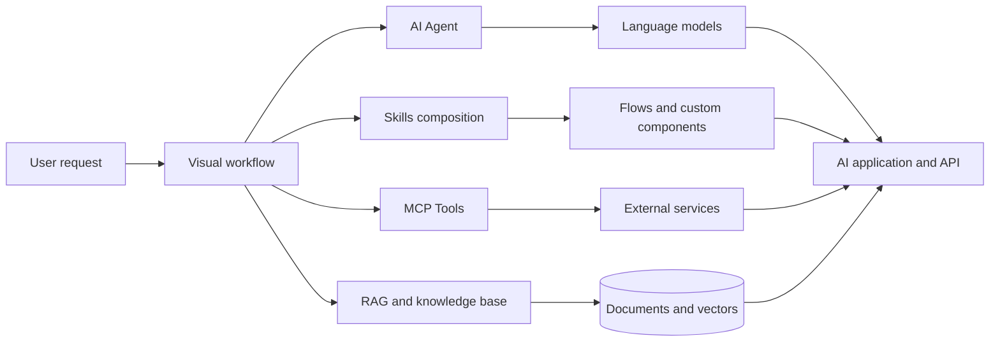
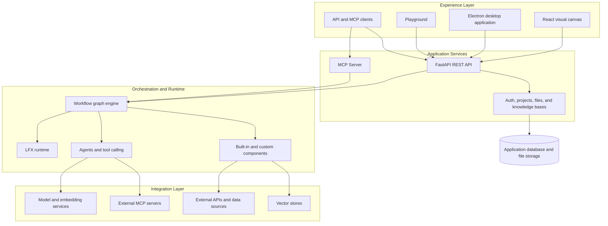

<!-- markdownlint-disable MD001 MD033 MD041 -->

<div align="center">

# OpenXFlow

### Build AI workflows with greater simplicity, openness, and flexibility.

An open-source AI workflow platform for developers.

[简体中文](./README.md) · [English](./README_EN.md)

[](./LICENSE)
[](https://github.com/lien0219/openxflow/stargazers)
[](https://github.com/lien0219/openxflow/forks)
[](https://github.com/lien0219/openxflow/issues)
[](https://github.com/lien0219/openxflow/pulls)


[Quick Start](#-quick-start) · [Desktop](#desktop-application) · [Core Capabilities](#-core-capabilities) · [Documentation](#-documentation) · [Contributing](#-contributing) · [GitHub Issues](https://github.com/lien0219/openxflow/issues)

</div>

## Overview

OpenXFlow is an open-source AI workflow platform for building, testing, running, and integrating AI applications through a visual interface.

It enables developers to connect large language models, agents, knowledge bases, data sources, APIs, MCP servers, and external tools into reusable and extensible workflows.

OpenXFlow supports both browser-based use and desktop applications for Windows and macOS.

> Connect, orchestrate, and reuse every AI capability.

## ✨ Highlights

| Capability | What it provides |
| --- | --- |
| Visual workflows | Connect models, prompts, tools, knowledge bases, and business logic on a node-based canvas |
| AI agents | Build agents that interpret tasks, select tools, and complete multi-step work |
| Skills extensions | Package domain capabilities with reusable flows, prompts, rules, tools, and components |
| MCP ecosystem | Connect external tools as an MCP client and expose project workflows as MCP tools |
| RAG and knowledge bases | Combine document processing, embeddings, vector search, and contextual generation |
| Multiple model providers | Use major cloud providers, local models, and API-compatible model services |
| Custom components | Extend nodes, tools, data processing, and integrations with Python |
| API services | Integrate workflows through REST APIs, webhooks, and MCP |
| Desktop application | Run on Windows x64, macOS Apple Silicon, and macOS Intel |
| Open deployment | Run locally, use desktop builds, build containers, deploy privately, and customize integrations |

## 🧩 Core Capabilities

### Visual AI Workflows

- Build workflows by dragging, connecting, and configuring nodes
- Combine models, prompts, data, tools, and flow-control components
- Pass text, messages, data, and structured results between nodes
- Test workflows interactively in the Playground and inspect execution results
- Import, export, and reuse workflows as JSON
- Run workflows through REST APIs, webhooks, or MCP

### AI Agents

- Configure agents with models, instructions, and context on the visual canvas
- Use built-in components, other agents, and MCP servers as callable tools
- Select tools and execute multi-step tasks based on the request
- Connect conversation memory, knowledge retrieval, and structured output components
- Test agent behavior in the Playground or through APIs

### Skills

Skills are OpenXFlow's way of organizing reusable AI capabilities. Domain knowledge, task procedures, prompts, rules, tools, and resources can be composed through workflows and custom components, creating clear capability entry points that can be reused across applications.

### MCP

- Connect external MCP servers through the MCP Tools component
- Use STDIO, Streamable HTTP, and compatible SSE transports
- Configure MCP servers from Settings or directly from the canvas sidebar
- Expose project workflows as MCP tools for external clients
- Connect MCP clients such as Cursor, Windsurf, and Claude Desktop

### RAG and Knowledge Bases

- Upload and process documents with text extraction, chunking, and metadata
- Generate vector representations with embedding models
- Perform semantic retrieval through knowledge bases and vector stores
- Add retrieved content to model context for knowledge-grounded answers
- Connect files, databases, websites, and third-party data sources through components

### Model and Component Ecosystem

- Integrate multiple LLM providers, embedding models, and local model services
- Use vector database, data processing, input/output, and tool components
- Create custom Python components and add them to the visual canvas
- Connect business systems through API requests, webhooks, and third-party integrations
- Extend and execute workflows with the LFX runtime

## 🔄 How It Works



Start with a user or business requirement, compose agents, reusable capabilities, MCP tools, and knowledge retrieval on the canvas, then run the workflow in the web or desktop interface, or integrate it through an API, webhook, or MCP.

## 🎯 Use Cases

| Use case | Description |
| --- | --- |
| Enterprise knowledge assistant | Connect organizational documents, data sources, and models to build retrieval-based question answering |
| AI customer support | Combine agents, knowledge bases, tool calls, and business APIs into controlled support workflows |
| Data analysis agents | Let agents query databases, call APIs, use analysis tools, and produce results |
| Content generation | Orchestrate models, prompts, data processing, and output components into reusable content pipelines |
| Developer tools | Connect coding tools, editors, and development workflows through MCP and reusable capabilities |
| Business process automation | Combine enterprise systems, external APIs, and AI models to automate multi-step tasks |

## 🏗️ Architecture



- **Experience layer:** Web visual canvas, Electron desktop application, Playground, and entry points for API and MCP clients.
- **Application services:** FastAPI endpoints for workflows, projects, files, knowledge bases, authentication, and MCP.
- **Orchestration and runtime:** The graph engine and LFX coordinate nodes, data flow, agents, and components.
- **Integration layer:** Model services, MCP servers, business APIs, data sources, and vector stores.

## Technology Stack

| Area | Technology |
| --- | --- |
| Frontend | React 19, TypeScript, Vite, Tailwind CSS, Zustand, XYFlow |
| Backend | Python 3.10–3.14, FastAPI, SQLModel / SQLAlchemy, Alembic |
| Desktop | Electron, electron-builder, Windows NSIS, macOS DMG |
| Workflow | Langflow graph execution engine, LFX |
| Agents | LangChain ecosystem, tool calling, structured output |
| Protocols | REST APIs, webhooks, MCP |
| Data storage | SQLite, optional PostgreSQL, file storage |
| Vector search | Components for Chroma, Qdrant, Weaviate, Pinecone, Milvus, FAISS, and more |
| Deployment | Local web builds, Windows/macOS desktop builds, Docker / Podman, Docker Compose, Dev Containers |

## 🚀 Quick Start

### Requirements

- Python `>=3.10,<3.15`
- Node.js `>=20.19.0` (v22.12 LTS recommended) and npm v10.9+
- `uv >=0.4`
- GNU Make for web source development

Windows web development should use WSL or the included Dev Container; the Windows desktop application runs directly on Windows.

### Clone the Repository

With SSH:

```bash
git clone git@github.com:lien0219/openxflow.git
cd openxflow
```

Or with HTTPS:

```bash
git clone https://github.com/lien0219/openxflow.git
cd openxflow
```

### Run the Web Application

Install dependencies, build the frontend, and start the application:

```bash
make run_cli
```

Open <http://localhost:7860>. To clear the frontend build cache before restarting, run:

```bash
make run_clic
```

### Desktop Application

Windows x64, macOS Apple Silicon arm64, and macOS Intel x64 are supported.

Install the desktop workspace and perform the first-time setup:

```bash
npm --prefix desktop install
npm --prefix desktop run dev:setup
```

For subsequent starts:

```bash
npm --prefix desktop run dev
```

See the [desktop guide](./DESKTOP.md) for packaging, platform setup, testing, and troubleshooting.

### Development Mode

```bash
make init
```

Start the backend and frontend in separate terminals:

```bash
make backend
```

```bash
make frontend
```

The backend listens on `http://localhost:7860`, and the frontend development server listens on `http://localhost:3000` by default. See the [complete development guide](./DEVELOPMENT.md) for environment setup, testing, and component development.

### Build and Run a Container

```bash
make docker_build DOCKER=docker
docker run --rm -p 7860:7860 langflow:1.10.2
```

## Project Structure

```text
openxflow/
├── .github/                 # GitHub workflows and repository configuration
├── deploy/                  # Deployment and observability configuration
├── desktop/                 # Electron desktop application, runtime, and packaging scripts
├── docker/                  # Container builds and development configuration
├── docker_example/          # Docker Compose example
├── docs/                    # Docusaurus documentation
├── scripts/                 # Build, test, and maintenance scripts
├── src/
│   ├── backend/             # FastAPI APIs and application services
│   ├── frontend/            # React / TypeScript web application
│   ├── lfx/                 # Lightweight workflow executor
│   ├── langflow-stepflow/   # Workflow step execution support
│   ├── sdk/                 # Python SDK
│   └── bundles/             # Optional component extension bundles
├── DESKTOP.md               # Windows and macOS desktop guide
├── README.md                # Simplified Chinese product overview
├── README_EN.md             # English product overview
├── DEVELOPMENT.md           # Development environment guide
└── CONTRIBUTING.md          # Contribution guide
```

## 📚 Documentation

| Document | Description |
| --- | --- |
| [DESKTOP.md](./DESKTOP.md) | Windows/macOS installation, startup, testing, and packaging |
| [DEVELOPMENT.md](./DEVELOPMENT.md) | Local development, Dev Containers, and environment setup |
| [CUSTOMIZATION.md](./CUSTOMIZATION.md) | Project maintenance and customization guide |
| [CONTRIBUTING.md](./CONTRIBUTING.md) | Contribution guide |
| [SECURITY.md](./SECURITY.md) | Security policy and vulnerability reporting |
| [CODE_OF_CONDUCT.md](./CODE_OF_CONDUCT.md) | Community code of conduct |
| [LICENSE](./LICENSE) | MIT License and copyright notices |

## 🤝 Contributing

Community contributions are welcome. You can report bugs, suggest features, improve documentation, build components, fix issues, or open a pull request.

- [Open an issue](https://github.com/lien0219/openxflow/issues)
- [View pull requests](https://github.com/lien0219/openxflow/pulls)
- [Read the contribution guide](./CONTRIBUTING.md)

## 🙏 Acknowledgements

OpenXFlow is built upon the excellent open-source [Langflow](https://github.com/langflow-ai/langflow) project.

Special thanks to the Langflow team and all community contributors for their work on visual AI workflows and agent development.

We also thank LangChain, FastAPI, React, Electron, and the broader open-source community.

## 📄 License

This project is open source under the [MIT License](./LICENSE).
